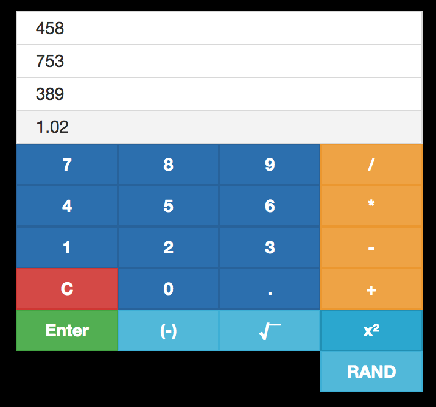

# React RPN ➕➖✖️➗

A dead-simple [Reverse Polish notation](https://en.wikipedia.org/wiki/Reverse_Polish_notation) calculator built with React and Redux. This project is purely for learning, testing, and demonstration purposes.

<p align="center">

</p>


## Development

### Requirements 

* Node v10.8.0 or later
* npm v6.2.0 or later

### Instructions

Clone the project and navigate to the project directory:

```bash
git clone https://github.com/apbendi/rpn-react.git
cd rpn-react
```

In the project directory, you can run:

### `npm start`

Runs the app in the development mode.<br>
Open [http://localhost:3000](http://localhost:3000) to view it in the browser.

The page will reload if you make edits.<br>
You will also see any lint errors in the console.

### `npm test`

Launches the test runner in the interactive watch mode.<br>
See the section about [running tests](https://facebook.github.io/create-react-app/docs/running-tests) for more information.

### `npm run build`

Builds the app for production to the `build` folder.<br>
It correctly bundles React in production mode and optimizes the build for the best performance.

The build is minified and the filenames include the hashes.<br>
Your app is ready to be deployed!

See the section about [deployment](https://facebook.github.io/create-react-app/docs/deployment) for more information.

## License

[MIT](./LICENSE.txt)<br/>
© Ben DiFrancesco, 2019
